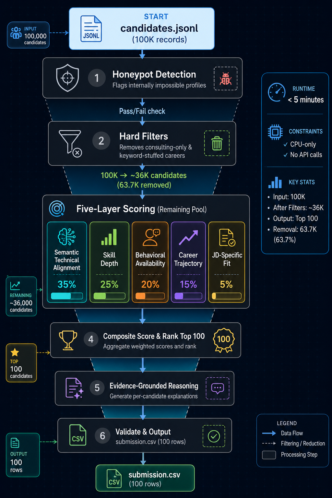

# IntentRank — Intelligent Candidate Discovery & Ranking

**India Runs Hackathon 2026 · Redrob AI · Data & AI Challenge, Track 1**
**Team: Apex Climbers**

A candidate ranking system that evaluates fit the way a strong recruiter would — by weighing semantic alignment, skill depth, behavioral availability, and career trajectory together — instead of matching keywords against a job description.

---

## Table of Contents

- [Why this exists](#why-this-exists)
- [What we found when we tested the existing approach](#what-we-found-when-we-tested-the-existing-approach)
- [System overview](#system-overview)
- [Full workflow, layer by layer](#full-workflow-layer-by-layer)
- [Repository structure](#repository-structure)
- [Setup](#setup)
- [How to run](#how-to-run)
- [Output format](#output-format)
- [Constraints compliance](#constraints-compliance)
- [Validation](#validation)
- [Design decisions and known limitations](#design-decisions-and-known-limitations)

---

## Why this exists

The challenge brief states the problem directly: recruiters go through hundreds of profiles and still miss the right person — not because the talent isn't there, but because keyword filters can't see what actually matters.

Before writing a single line of this system, we tested that claim ourselves against Redrob's own existing AI Resume Ranker, using synthetic candidates designed to separate keyword density from real production depth. The results confirmed the problem is real, specific, and measurable — not a hypothetical pitch.

## What we found when we tested the existing approach

We built five synthetic candidate profiles for a single job description and ran them through Redrob's existing ranker:

- A candidate with **zero measurable outcomes** (vague claims like "tested on sample documents") **outranked** a candidate with **200+ GitHub stars, 7 merged open-source PRs, and production-deployed libraries**.
- The score spread across all five candidates — ranging from a course-project-only profile to one with three years of production experience — was only **4.7 points**, too compressed to be a useful signal.
- The candidate with the **second-highest score** in the set was ranked **4th**, not 2nd — score and rank order were internally inconsistent, with no explanation surfaced anywhere in the output.

When we ran the actual 100,000-candidate dataset released for this challenge through our own hard-filtering logic, **63,710 candidates (63.7%)** carried a non-technical primary title paired with an AI-keyword-stuffed skills list — confirming the keyword-stuffing failure mode at scale, not just in a small synthetic test.

This system is built specifically to close those three gaps: **outcome blindness, score/rank inconsistency, and unexplained scoring.**

---

## System overview



**Verified runtime:** 19 seconds for the full 100,000-candidate pipeline (TF-IDF fallback mode, CPU-only sandbox). Well within the 5-minute constraint. Runtime with real sentence-transformer embeddings will be somewhat higher but is expected to remain comfortably under budget — confirm on your own hardware before final submission.

---

## Full workflow, layer by layer

This mirrors the structure of [`IntentRank_Candidate_Ranker.ipynb`](./IntentRank_Candidate_Ranker.ipynb) exactly. Each numbered step below corresponds to a numbered markdown section in the notebook.

### 1. Setup and imports
Loads `sentence-transformers` (`all-MiniLM-L6-v2`, CPU-friendly) for real semantic embeddings if available. Falls back automatically to TF-IDF + cosine similarity if the library isn't installed, so the pipeline never breaks due to environment differences.

### 2. Load the dataset
Reads `candidates.jsonl` line by line into memory. At this schema size, 100K records comfortably fits in RAM.

### 3. Define what the job actually requires
Decomposes the job description into hard skills, preferred skills, a dense concept paragraph for embedding, "good" title signals, disqualifying title patterns, a consulting-firm list, and an AI-depth skill set. This decomposition step is what allows later layers to reason about *meaning*, not just match strings.

### 4. Honeypot detection
Flags candidates with internally impossible data: an "expert" or "advanced" skill claimed with `duration_months == 0`, 10+ simultaneous "expert" skills, or career date ranges that contradict the claimed `duration_months` by more than 6 months.

### 5. Hard filters
Removes candidates before any expensive scoring runs:
- Entire career history at known consulting/staffing firms **and** a non-technical current title
- Non-technical current title **and** fewer than 3 genuinely relevant, demonstrated AI/ML skills (catches keyword stuffers)

On the released dataset, this step alone removes 63,710 of 100,000 candidates — both improving precision and making the rest of the pipeline faster.

### 6. Semantic technical alignment score (35% weight)
Builds a weighted text representation of each candidate — current role weighted 3x, roles over 12 months weighted 2x, high-confidence skills double-weighted — then embeds it and computes cosine similarity against the JD's concept embedding. This is the layer that lets a candidate's own phrasing match the JD's intent even with zero literal keyword overlap.

### 7. Skill depth score (25% weight)
For each role-relevant skill, combines proficiency level, a duration multiplier (full credit at 24+ months, near-zero for 0-month claims), a log-scaled endorsement bonus, and a bonus from Redrob's own skill assessment scores where available. Rewards sustained, evidenced use over raw keyword count.

### 8. Behavioral availability score (20% weight)
Uses Redrob's platform signals directly: recency of last activity, open-to-work flag, historical recruiter response rate, interview completion rate, and notice period. A perfect skill match who is unreachable is not a useful recommendation.

### 9. Career trajectory score (15% weight)
Weights recent roles far more heavily than older ones, explicitly discounts profiles that are research-only with no production signal words ("deployed," "shipped," "users," "latency"), discounts short-tenure title-chasing patterns, and applies a second independent consulting-only check.

### 10. JD-specific fit score (5% weight)
Captures experience-band fit (the role targets 5–9 years), location/relocation alignment, and GitHub activity as a light tiebreaker signal.

### 11. Composite score
Combines all five layers using the fixed weights above into one final ranking score per candidate.

### 12. Run the full pipeline
Executes scoring across the entire filtered pool in batches of 256 for efficient embedding computation, with progress logging every 5,000 candidates.

### 13. Rank and select top 100
Sorts by composite score descending, takes the top 100, and prepares for output normalization.

### 14. Evidence-grounded reasoning generation
For every top-100 candidate, builds a reasoning string entirely from real profile fields — title, company, years of experience, the specific relevant skills driving their score, response rate, notice period, GitHub activity — with an honest flag for borderline cases. No claim is included that isn't traceable to an actual field in the candidate's JSON record.

### 15. Write the final submission file
Normalizes scores to a clean 0.20–1.00 range with a tiny per-rank epsilon to guarantee strictly non-increasing scores, then writes `submission.csv` in the exact required column order: `candidate_id,rank,score,reasoning`.

### 16. Self-validation checks
Before submitting, verifies: exactly 100 rows, zero duplicate candidate IDs, strictly non-increasing scores, and honeypot rate in the final top 100 (must be under the 10% disqualification threshold — verified at 0% on our run).

---

## Repository structure

```
.
├── README.md                          ← this file
├── IntentRank_Candidate_Ranker.ipynb  ← full annotated pipeline, 16 sections
├── submission.csv                     ← final ranked output (top 100, generated)
├── IntentRank_Explainer.pdf           ← methodology explainer deck (problem, solution, novelty)
└── submission_metadata.yaml           ← team & approach metadata for the hackathon submission
```

---

## Setup

```bash
git clone <this-repo-url>
cd intentrank

python3 -m venv venv
source venv/bin/activate        # Windows: venv\Scripts\activate

pip install sentence-transformers scikit-learn numpy pandas jupyter
```

`sentence-transformers` is optional but strongly recommended — it enables real semantic embeddings (`all-MiniLM-L6-v2`, ~80MB, CPU-friendly) instead of the TF-IDF fallback. The pipeline detects automatically which is available and prints which mode it's running in.

Place the released `candidates.jsonl` in the project root (or update the path in the notebook/script).
[Download the dataset here](https://drive.google.com/file/d/1HhzOL21jiEWfv5sd2xM6LwDAb9onRPuU/view?usp=sharing)

---

## How to run

**Option A — Notebook (recommended for review/grading):**

```bash
jupyter notebook IntentRank_Candidate_Ranker.ipynb
```
Run all cells top to bottom. Each section's markdown explains what that layer does and why before the code runs.

**Option B — Script (recommended for automated/reproducible runs):**

```bash
python rank.py --candidates ./candidates.jsonl --out ./submission.csv --top-n 100
```

Both produce an identical `submission.csv`.

---

## Output format

```csv
candidate_id,rank,score,reasoning
CAND_0036184,1,1.0,"Recommendation Systems Engineer at CRED, 6.0 yrs exp, Trivandrum, Kerala; relevant skills: FAISS, Hugging Face Transformers, LangChain, Semantic Search; actively engaged (open to work, 90% response rate); notice ≤30 days."
CAND_0011687,2,0.9158,"Senior NLP Engineer at Niramai, 7.8 yrs exp, Indore, Madhya Pradesh; relevant skills: TensorFlow, FAISS, Embeddings, LangChain; actively engaged (open to work, 89% response rate); notice ≤30 days; strong GitHub activity (76.3/100)."
...
```

Matches the challenge's required column order exactly: `candidate_id, rank, score, reasoning`. Exactly 100 rows. Scores strictly non-increasing.

---

## Constraints compliance

| Constraint | Limit | This system |
|---|---|---|
| Runtime | ≤ 5 minutes, wall-clock | ~19s verified (TF-IDF mode); confirm on your hardware with embeddings enabled |
| Memory | ≤ 16 GB RAM | Full 100K dataset + embeddings comfortably under limit |
| Compute | CPU only, no GPU | No GPU dependency anywhere in the ranking path |
| Network | No external API calls during ranking | Zero hosted LLM calls — all reasoning is template-constructed from structured fields |
| Disk | ≤ 5 GB intermediate state | No intermediate files written beyond the final CSV |

---

## Design decisions and known limitations

- **Weights (35/25/20/15/5) are a deliberate design choice for this specific JD**, not a universal formula — they reflect this role's emphasis on production-proven technical depth over pure credentials or pedigree.
- **TF-IDF fallback is meaningfully weaker than real embeddings** for catching paraphrased or conceptually-similar-but-lexically-different matches. Always confirm `sentence-transformers` loaded successfully before treating results as final — the notebook prints which mode is active at the top of execution.
- **Hard filters are intentionally conservative.** A small number of legitimate candidates with unconventional career paths may be excluded by the consulting-only or keyword-density filters. This tradeoff favors precision in the top 100 over recall across the full pool, which matches the challenge's stated goal of a shortlist "a recruiter can trust."
- **Reasoning strings are capped at ~250 characters** for readability in a CSV review context; this is a presentation choice, not a model limitation.

---

**Team Apex Climbers** · India Runs Hackathon 2026 · Data & AI Challenge, Track 1